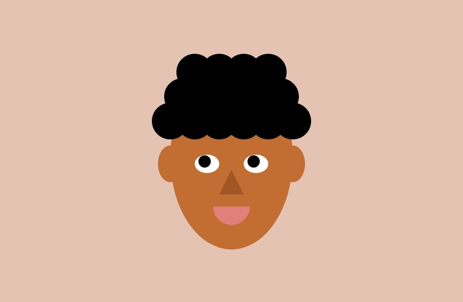

Here's my self-portrait done in p5.js - 

https://editor.p5js.org/AakSin/sketches/44FGfm2yX

# Process

I started off by sketching a basic sketch out on a piece of paper. For the curly hair I decied to use a series of circles. In the code, I implemented it using a for loop sketching out a series of black circles. For the face I decided to go with an oval which was simply done by coding an ellipse. For the ears and eyes too I used ellipses. For the mouth I decided to use the arc function and created a sem-circle. For interactivity, I made it so that the eyes would follow the mouse. That was done by using MouseX and MouseY for placing the blacks of the eyes. I soon realized that the blacks of the eyes would escape their appropriate bounds using this method. Hence, I chose to divide it by a huge number like 100 so that it would stray only 4 pixels further.

# Learning/After-Thoughts

I wanted to make the hair better but I couldn't figure out a way to simulate curly hair using just basic shapes. I should have added eyebrows in as well to add more detail to the face.
