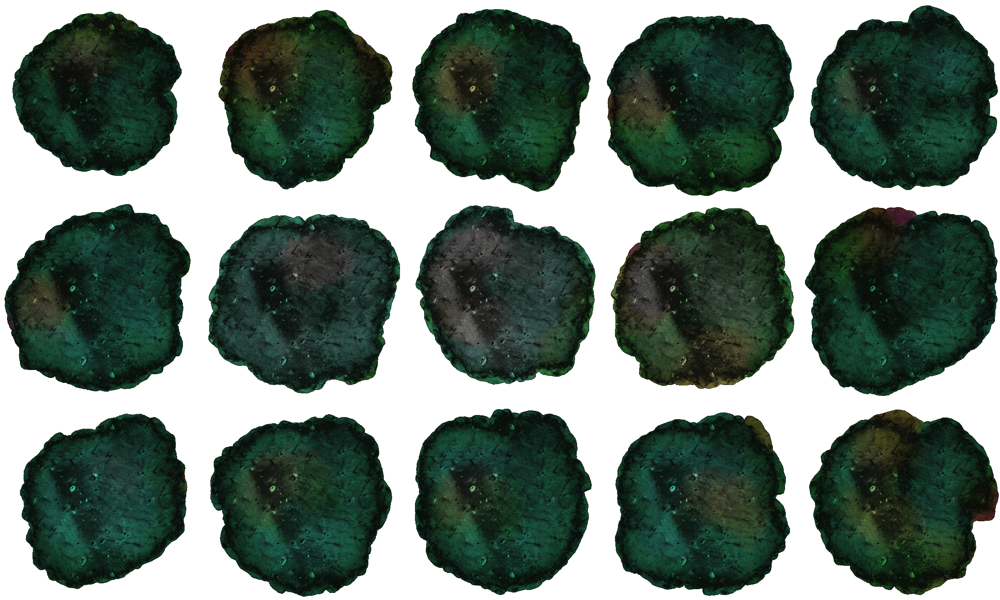

# Week 5
## Concepts, Sketches and Ideas

  

I spent the majority of the time on sketches, ideas and music for the game during the weekend. After a lot of sketching and ideation, I came up with this game concept - 
a character (sketched in the last sketch) floats in space while randomly generated planets spawn to the beat of the music. The character can be controlled by the arrow keys and
the goal of the game is to dodge these randomly spawning planets by floating up and down. The game lasts the duration of the song. If the song finishes, you win the game.
[The song](https://www.youtube.com/watch?v=esjN9TdbzdE) is 4 minutes in length.
    
Some of the initial ideas as you can see in the sketches were a forest with spirits in it, and you had to interact with the spirits to obtain certain points to win the game. I felt it would
just be a lot of dialog, so I decided not to do that. Another idea was a bird rowing a boat and dodging stones that spawn to music. I couldn't find a song I liked for that
so I went with this idea. This gives me a lot of customizability in terms of planet design as well.

## Coding
Most of the coding I have done is just trying to understand all the sound analysis offered by p5.js. I have looked through amplitude analysis, waveform analysis and frequency analysis. The code for my experiments with these 
analysis to the selected song can be found [here](https://github.com/AakSin/IntroToIM/tree/main/week5). I will need some help understanding all this music data and chosing
which points to spawn the planets to in the song (I have the beat drop, the kicks and vocal highs in mind). 

  

    
## To Do
Through office hours, I will first get a thorough understanding of all the music analysis P5 offers. Then i'll code the parameters out on which to spawn the planet.
Before focusing on the art I will focus on making a simple prototype of the game. Then I will start working on the art for the character (I plan on sketching an SVG) and 
writing code for the generative art planets (I plan on using createGraphics and masking for that, unless there exists a simpler way). 

# Week 6 and 7

## Concept and Art

I realized chosing the music was quintessential for me to proceed with my project. I spent some time listening to tracks that matched the final sketch I had done and finalized [Pocky Boy by Yeule](https://www.youtube.com/watch?v=muCYlrHjg3o).
I started sketching her out based on her outfit and makeup in Serotonin II (the album pocky boy is from). Here's her side by side with a reference pic on Procreate.

I was also looking to make my own background and here is a version I came up with on procreate. It didn't match the game's color pallete and hence I didn't stick with it.
Instead I went for a coded background that reacts to music.

I also wanted to do all of the planet's sprite sheets by myself but then I decided coding them out would be interesting as well. Here's 1 planet that I finished the animation for.

The rest of the planets that are not coded were downloaded from Deep Fold's pixel planet generator on itch.io. Credits given at the end.

# Coding - challenges and solutions

- One of the main problems was triggering events like the planet generation to music. A lot of time was spent on this step. I had office hours with the professor
regarding this as well. She recommended recording the mids+highs or setting up intervals. I tried both approached and seperately on both .amplitude() and .fft() but
neither worked well. I decided to combine both approaches and that finally worked. The code runs differently for the parts with synths and the parts with drums. Also
the planet generation was being too frequent for the game to be playable, hence I set up a frame count difference so that if the trigger event happened in less than 30
frames, then it would simply skip it.

https://github.com/AakSin/IntroToIM/blob/1b94285b3da6f0c39b9eefe3ad80f54d6c484b6b/week5/game/sketch.js#L113-L150

- Another challenge was getting the planets which are procedurally generated by code to display correctly. This process had a lot of hassles including the planets sometimes
being squares. Sometimes only 1 frame was displayed of the planets. Sometimes the color generation wasn't correct. The optimum approach was found to be mask a createGraphic element.
I soon found out that wasn't possible and hence I applied the solution found [here](https://github.com/processing/p5.js/issues/3900) - creating an image from the graphic each frame and applying the mask to it.

## Credits

(Ahmed Moussa's p5 sketch of a galaxy)[https://editor.p5js.org/AhmadMoussa/sketches/euZJvkj5i]

(Deep Fold's pixel planet generator) [https://deep-fold.itch.io/pixel-planet-generator]

